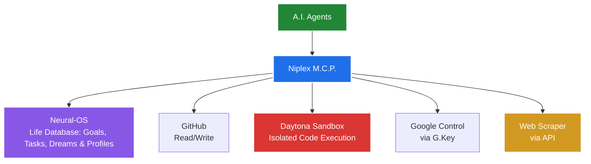

# NIPLEX-MCP 🚀

A professional Model Context Protocol (MCP) server designed as a secure, high-authority bridge between AI agents and developer infrastructure.

## 🎯 Purpose
NIPLEX-MCP allows AI agents to interact with private GitHub repositories, the Neural-OS life database, and execute code in isolated, disposable environments without exposing sensitive credentials or risking the host system.

## 🏗️ Architecture Flow


## 🏗️ Modular Architecture
The server is built with a decoupled architecture to ensure scalability and maintainability:

- **`integrations/`**: Low-level API wrappers.
  - `github.py`: Handles authenticated requests to the GitHub REST API.
  - `daytona.py`: Manages the lifecycle of disposable sandboxes using the Daytona SDK.
  - `neural_os.py`: Bridge to the internal life database.
  - `scraper.py`: Interface for web data extraction.
- **`tools/`**: The orchestration layer.
  - `manager.py`: Maps integration capabilities into high-level tools for the agent.
- **`server.py`**: The FastMCP entry point that exposes tools to the connected AI client.

## 🛠️ Key Capabilities

### 1. Secure GitHub Bridge
- **`list_github_files`**: Recursively maps the repository structure.
- **`read_github_file`**: Retrieves file contents using secure PAT authentication.

### 2. Disposable Execution (Daytona)
- **`execute_in_sandbox`**: The "Ghost Sandbox" pattern.
  - **Provision**: Spawns a fresh Daytona sandbox.
  - **Execute**: Runs the requested shell command.
  - **Destroy**: Immediately deletes the sandbox to save credits and maintain security.

### 3. Life Database (Neural-OS)
- **`query_neural_os`**: Access goals, tasks, and user profiles.
- **`update_neural_os`**: Persist new memories or update goals.

### 4. Web Intelligence (Scraper)
- **`scrape_website`**: Extract high-fidelity content from the web via API.

## 🚀 Getting Started

### Environment Variables
The server requires the following variables to be set in the environment:
- `GITHUB_PAT`: Your GitHub Personal Access Token.
- `DAYTONA_API_KEY`: Your Daytona API Token.
- `NEURAL_OS_URL`: URL of the Neural-OS instance.
- `SCRAPER_API_KEY`: API key for the scraper service.

### Installation & Run
```bash
pip install fastmcp requests daytona-sdk
python server.py
```

---
**NEVER STOP IMAGINING** | Orchestrated by Niplex-AI
