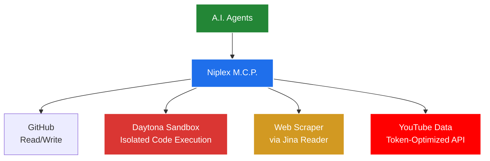

# NIPLEX-MCP 🚀

A professional Model Context Protocol (MCP) server designed as a secure, high-authority bridge between AI agents and developer infrastructure.

## 🎯 Purpose
NIPLEX-MCP allows AI agents to interact with private GitHub repositories and execute code in isolated, disposable environments without exposing sensitive credentials or risking the host system.

## 🏗️ Architecture Flow

```mermaid
graph TD
    %% Main Flow
    Agents[A.I. Agents] --> MCP[Niplex M.C.P.]

    %% Core Systems & Integrations
    MCP --> GitHub[GitHub<br/>Read/Write]
    MCP --> Daytona[Daytona Sandbox<br/>Isolated Code Execution] 
    MCP --> Scraper[Web Scraper<br/>via Jina Reader]
    MCP --> YouTube[YouTube Data<br/>Token-Optimized API]

    %% Styling
    style MCP fill:#1f6feb,stroke:#fff,stroke-width:2px,color:#fff
    style Agents fill:#238636,stroke:#fff,stroke-width:1px,color:#fff
    style Daytona fill:#da3633,stroke:#fff,stroke-width:1px,color:#fff
    style Scraper fill:#d29922,stroke:#fff,stroke-width:1px,color:#fff
    style YouTube fill:#ff0000,stroke:#fff,stroke-width:1px,color:#fff
```

## 🏗️ Modular Architecture
The server is built with a decoupled architecture to ensure scalability and maintainability:

- **`integrations/`**: Low-level API wrappers.
  - `github.py`: Handles authenticated requests to the GitHub REST API.
  - `daytona.py`: Manages the lifecycle of disposable sandboxes using the Daytona SDK.
  - `core_bridges.py`: Web scraper (via Jina), You.com search bridge, and cache service.
  - `youtube.py`: Token-optimized YouTube Data API bridge.
  - `mcp_bridge.py`: Orchestration layer for remote MCP server delegation (not yet wired to a tool).
- **`tools/`**: The orchestration layer.
  - `manager.py`: Maps integration capabilities into high-level tools for the agent.
- **`server.py`**: The FastMCP entry point that exposes tools to the connected AI client.

## 🛠️ Key Capabilities

### 1. Secure GitHub Bridge
- **`list_github_files`**: Recursively maps the repository structure.
- **`read_github_file`**: Retrieves file contents using secure PAT authentication.
- **`write_github_file`**: Creates or updates a file with a commit message.

### 2. Disposable Execution (Daytona)
- **`execute_in_sandbox`**: The "Ghost Sandbox" pattern.
  - **Provision**: Spawns a fresh Daytona sandbox.
  - **Execute**: Runs the requested shell command.
  - **Destroy**: Immediately deletes the sandbox to save credits and maintain security.

### 3. Intelligence & Search
- **`scrape_website`**: Extract high-fidelity content from any URL via Jina's reader.
- **`search_web`**: Search via You.com — uses the official API if `YOU_COM_API_KEY` is set, otherwise falls back to a free, key-less search through Jina's reader.
- **`search_youtube`**: Find videos and channel stats with minimal token overhead.
- **`get_youtube_details`** / **`get_youtube_stats`**: Fetch details for specific video/channel IDs.

## 🚀 Getting Started

### Environment Variables
The server requires the following variables to be set in the environment:
- `GITHUB_PAT`: Your GitHub Personal Access Token.
- `DAYTONA_API_KEY`: Your Daytona API Token.
- `YOUTUBE_API_KEY`: Your Google YouTube Data API v3 key.
- `YOU_COM_API_KEY` (optional): Your You.com API key — if unset, `search_web` uses the free fallback.

### Installation & Run
```bash
pip install -r requirements.txt
python server.py
```

---
**NEVER STOP IMAGINING** | Orchestrated by Niplex-AI
  - `neural_os.py`: Bridge to the internal life database.
  - `scraper.py`: Interface for web data extraction.
  - `you_com.py`: High-authority agentic search bridge.
  - `youtube.py`: Token-optimized YouTube Data API bridge.
  - `mcp_bridge.py`: Orchestration layer for remote MCP server delegation.
- **`tools/`**: The orchestration layer.
  - `manager.py`: Maps integration capabilities into high-level tools for the agent.
- **`server.py`**: The FastMCP entry point that exposes tools to the connected AI client.

## 🛠️ Key Capabilities

### 1. Secure GitHub Bridge
- **`list_github_files`**: Recursively maps the repository structure.
- **`read_github_file`**: Retrieves file contents using secure PAT authentication.

### 2. Disposable Execution (Daytona)
- **`execute_in_sandbox`**: The "Ghost Sandbox" pattern.
  - **Provision**: Spawns a fresh Daytona sandbox.
  - **Execute**: Runs the requested shell command.
  - **Destroy**: Immediately deletes the sandbox to save credits and maintain security.

### 3. Life Database (Neural-OS)
- **`query_neural_os`**: Access goals, tasks, and user profiles.
- **`update_neural_os`**: Persist new memories or update goals.

### 4. Intelligence & Search
- **`scrape_website`**: Extract high-fidelity content from the web via API.
- **`search_web`**: Agentic search via You.com for deep research.
- **`search_youtube`**: Find viral outlier videos and channel stats with minimal token overhead.

### 5. MCP Orchestration
- **`call_remote_mcp`**: Delegate specific tool execution to other connected MCP servers, turning Niplex-MCP into a Master Orchestrator.

## 🚀 Getting Started

### Environment Variables
The server requires the following variables to be set in the environment:
- `GITHUB_PAT`: Your GitHub Personal Access Token.
- `DAYTONA_API_KEY`: Your Daytona API Token.
- `NEURAL_OS_URL`: URL of the Neural-OS instance.
- `SCRAPER_API_KEY`: API key for the scraper service.
- `YOUTUBE_API_KEY`: Your Google YouTube Data API v3 key.
- `YOU_COM_API_KEY`: Your You.com API key.

### Installation & Run
```bash
pip install fastmcp requests daytona-sdk
python server.py
```

---
**NEVER STOP IMAGINING** | Orchestrated by Niplex-AI
